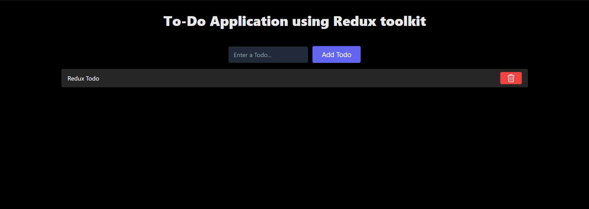

# To-Do Application

A simple and interactive To-Do application built with React that allows users to manage their tasks efficiently. The app supports task creation, deletion of tasks as completed.

## Features

- Add new tasks with a title.
- Delete tasks.

## Demo

<a href="https://todo-app-rtk-react.netlify.app/" >Link to To-Do Application</a>

## Technologies Used

- **React** - A JavaScript library for building user interfaces
- **redux** - state management
- **Tailwind CSS** - A utility-first CSS framework for designing responsive interfaces
- **Hooks** - To manage state and lifecycle in functional components
- **Context API** - To manage global state

## Screenshots

